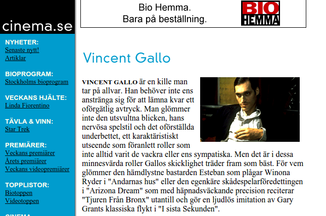
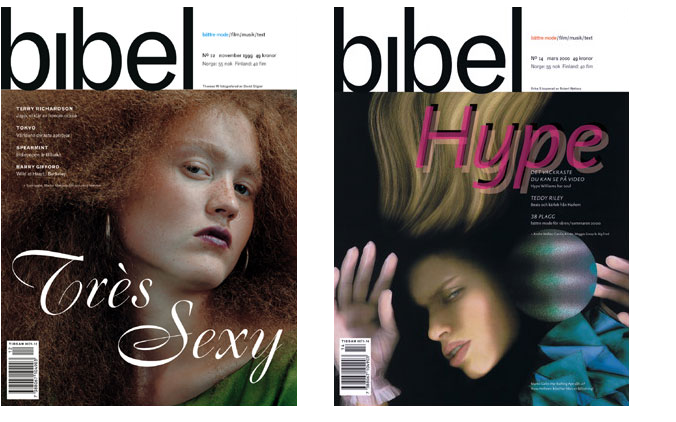
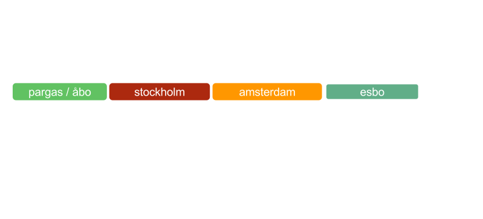

---
title       : Intro
author      : Sami Kallinen
job         : Head of Web & Mobile Development
framework   : impressjs        # {io2012, html5slides, shower, dzslides, ...}
highlighter : highlight.js  # {highlight.js, prettify, highlight}
hitheme     : tomorrow      # 
widgets     : mathjax            # {mathjax, quiz, bootstrap}
mode        : selfcontained # {standalone, draft}
knit        : slidify::knit2slides

--- x:0 y:-30000 z:50000

# Sami Kallinen  

--- x:0 y:-20000 z:50000

# Bakgrund
        

--- x:0 y:0 z:50001

## Tidsaxeln
        

--- x:-18500 y:-5600 scale:5

# 1983: Spectravideo SV-318
*Där det började...*
 
 

<iframe width="630" height="472" src="https://www.youtube.com/embed/pRd29CuXxfE" frameborder="0" allowfullscreen></iframe>

--- x:-6000 y:11000 scale:5

# 1995: cinema.se
### Grundare och chefredaktör
- En av världens första dagligt uppdaterade journalistiska filmsajter.
 
 

--- x:-2700 y:-8000 scale:5

# 1998: Tidningen Bibel
### Filmredaktör och en av grundarna
- Livstidsmagasin för Bonniers.
- Behandlade pop, mode, litteratur, film och annan kultur.
- Första numret utkom 1998.
 
 

--- x:6000 y:-8000 rot:0 scale:5

# 2008: Pixel
### Producent  
- Yle FST5 kulturmagasin.
- Första avsnittet sändes mars 2009.
 
 
<iframe src="https://player.vimeo.com/video/9064795" width="750" height="423" frameborder="0" webkitallowfullscreen mozallowfullscreen allowfullscreen></iframe>

--- x:8500 y:11000 rot:0 scale:5

# 2011: svenska.yle.fi

### Webbchef  
- Ansvarade för webbstrategin.
- Satte igång och faciliterade webbförnyelsen, med fokus på följande:  
        - Plattformen och produktkonceptet  
        - Webborganisationen  
        - Innehållstänket  
 
 

--- x:13000 y:-8000 rot:0 scale:5

# 2012: yle.fi  
### Utvecklingschef för Webb & Mobil  
- Ansvarig för Yles digitala produktportfölj, resursering och webbmediestrategi
- Driver operativt teamet som ansvarar för bolagsgemensam funktionalitet  
        - Data & Analytik  
        - Hittbarhet  
        - Yle Profil  
        - Metadata  

Några highlights:  
        - API strategin  
        - Införandet av en agil portföljledningsmodell och process  
        - Datastrategin  

 
 

--- x:0 y:0 z:50000

## Tidsaxeln
        

--- x:0 y:0 z:50001

## Tidsaxeln
        

--- x:0 y:30000 z:50000

### Personlig fokus genom åren
        

--- x:0 y:32000 z:50000

# Data

--- x:0 y:33000 z:50000

# Varför ska vi bry oss?

--- x:0 y:34000 z:50000

## Den digitala revolutionen har alltid handlat främst om data

--- x:0 y:36000 z:50000

# Bättre insikter 

### Webben, allt billigare datalagringsteknologier, personliga datorer (läs: telefoner) och sociala tjänster har möjliggjort en ackumulering av data på en aldrig tidigare skådad nivå.  
 

Den enorma datamassan som uppdateras i realtid kan användas till att härleda **insikter** om pågående situation men också till att **prediktivt analysera** det som sannolikt händer till näst. Den här typens analys har visat sig att ofta kunna bättre och snabbare **prognostisera trender** om till exempel arbetslöshet[$^1$](https://books.google.fi/books?id=aYvAK28UkjUC&printsec=frontcover&dq=douglas+hubbard&hl=en&sa=X&redir_esc=y#v=onepage&q=unemployment&f=false), förkylningsepidemier och politiska opinioner[$^2$](http://www.cs.cmu.edu/~nasmith/papers/oconnor+balasubramanyan+routledge+smith.icwsm10.pdf) än klassisk panelbaserad research.

--- x:0 y:38000 z:50000

# Innehållsproduktion och publicering

### Inom media har vi data om användares *profiler*, om vårt *innehåll* och om *användarbeteendet* på våra tjänster. Media kan använda data som stöd för innehållsproduktion, produktutveckling, publicering och strategi.  
 

Exempelvis talar vi om **taktisk data**, som ger redaktioner en klarare bild över hur relevant det egna innehållet är just nu och hur det klarar sig i konkurrensen.  
 

Data kan användas **minut för minut** för att anpassa redaktionsarbetet till det som händer där ute och för att fånga relevanta användargrupper som just då råkar vara intresserade av ett specifikt ämne eller samlade på någon plattform.

--- x:0 y:40000 z:50000

# Ett längre perspektiv

### Prediktiv analys kan användas som ett verktyg när man planerar större innehållssatsningar. Det klassiska exemplet är Netflix *House of Cards*[$^3$](http://www.nytimes.com/2013/02/25/business/media/for-house-of-cards-using-big-data-to-guarantee-its-popularity.html)[$^4$](http://www.theguardian.com/media/2014/feb/23/netflix-viewer-data-house-of-cards)[$^5$](http://www.fastcodesign.com/1671893/the-secret-sauce-behind-netflixs-hit-house-of-cards-big-data). Netflix använde extensivt datan om deras användare och deras beteende när de utvecklade serien.  
 

Data ersätter självfallet inte det kreativa arbetet, som är lika svårt som det alltid varit men det är ett nytt livsviktigt verktyg som hjälper skaparna att få det rätt.  
 
På motsvarande sätt kan dessa verktyg utnyttjas till **strategiskt arbete**.

--- x:0 y:42000 z:50000

# Att idag jobba utan stödet från data är som att köra i mörker utan lyktor

--- x:0 y:44000 z:50000

# Utveckling av digitala produkter 

### Inom produktutveckling använder vi data för att kunna minnas och betjäna användaren bättre. Vi vet vad användaren sannolikt gillar och försöker direkt erbjuda relevant innehåll.   
 

Data utnyttjas till att förbättra tjänsten överlag. Modern produktutveckling bygger på experiment, där man analogt med den vetenskapliga metoden **formulerar hypoteser** om egenskaper och förbättringar man tror användaren vill ha och behöver, som man sedan testar live på tjänsten med kontrollgrupper innan förbättringen lanseras åt alla användare.

--- x:0 y:46000 z:50000

# Livskraft

### På samma sätt som data är ett väsentligt redskap för media för att göra relevant innehåll och välfungerande produkter, är det här något som alla organisationer behöver för att kunna serva sina användare och kunder. 
 

Få organisationer har tjänster som producerar så rik och omfattande data som mediabolag har.  
 

När den klassiska affärsmodellen för dagstidningar håller på att vittra sönder är det här vi kommer att hitta de **nya inkomstkällorna**. Syftar inte på annonsförsäljning. Ponera att en dagligvarukedja behöver kunna prognostisera kundflödet till västra nyland de kommande sju dagarna bättre. Genom att använda moderna sk. "machine learning" metoder kan vi möjligtvis hitta dolda korrelationer mellan hur våra användare beter sig på våra tjänster och hur sannolikt det är att de åker till sommarstugan på fredag. Det här är värdefull information för våra kunder.

--- x:0 y:48000 z:50000

# Ansvar

### När allt fler organisationer inser nyttan med data kommer vi också att se allt fler som börjar samla den, vilket kan leda till problem. Man kan samla det på ett *oetiskt* sätt. Data kan *missbrukas* kommersiellt.  
 

Media bör utveckla **etiska principer** och processer där personintegritet värnas. Det ligger i vårt ansvar att alltid i första hand se till **våra användares** bästa.

Media har bättre förutsättningar än andra att lyckas med detta i och med den traditionella pressetiken som finns i ryggmärgen i journalistiska organisationer.

--- x:0 y:50000 z:50000

# TACK!

### @SAKALLI

 
 
 
 
[Klicka här för källkoden till presentationen](https://github.com/skallinen/intro/tree/gh-pages)

--- x:0 y:52000 z:50000

### *"We may say most aptly, that the Analytical Engine weaves algebraical patterns just as the Jacquard-loom weaves flowers and leaves."*  
### *Ada Lovelace*

